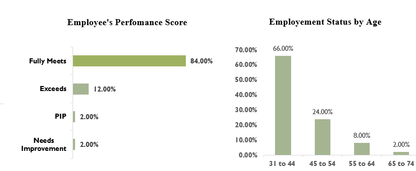

## HR Analysis And Visualisation

This Dataset was Sorted from [Kaggle](https://www.kaggle.com/datasets/rhuebner/human-resources-data-set). Thanks to Dr.Rich huebner and his team for creating and also making the Hr dataset to be available for practice.

## Introduction

This is a Microsoft excel project on Human Resources Analysis. This HR dataset was created by  Dr. Carla Patalano and Dr. Rich Huebner, to  teach students how to use and analyze the data. The Aim of this project is to analyze the data and create insightful visualizations to answer Human Resources question.

## Project Objective

- To know which Department Performs Well
- The Employment Rate and Termination rate.
- What department is likely to have shortage in staffs?

## Data Tools
Power Query and Pivot Table

## Data Cleaning/Manipulation

The dataset was imported to power query on Excel. It consists of 36 columns and 311 rows.
.png)
.png)
.png)

### Data Procedures

- Converted DOB data type from text to date, then to age, then created age range column for visualization purpose. The initial DOB column is removed.
- Replaced the values in marital id, from 0 and 1, to No and Yes.
- Renamed the MaritalDesc column to marital status. The initial marital status is removed
- Renamed the sex column as Gender as it had the proper identification for gender. The initial Sex column in the data table is removed.
- Converted salary data type from text to Currency ($)
- Renamed the Citindesc column to only citizen, also race
- Converted the data type of Date of hire and termination to Date data-type
- Removed job diversity fair column, it had plenty null vales and also, it is indicated on the recruitment process column and also position id column. To avoid data inconsistencies, it is removed.
- The termination reason column in the datasets, has value of everyone who had reason to terminated or that was terminated. Therefore, the TermId column is removed.
- The following columns were removed ; Zip code, department id, manager id, employee id, EmpstatusId, Hispanic/latino, as they all have alternative columns in the dataset.

All procedures taken during the analysis, is to ensure an error free data. At the end of data cleaning, there are 26 columns and 311 rows. Below is what the cleaned data looks like.

.png)
.png)

## Data Visualization

### All insights can be filtered by departments.

In accordance with the stated objective;	

- Departments with the highest performance score

According to the employee performance score, the IT/IS Department ranked of 84% at Fully meet criteria ratio, having 12% at Exceeds criteria. Thus making the department rank 1st overall. This could possibly be as a result of having more younger people in department

- The Employment Rate and Termination rate

The year 2011, has the highest employement rate while the year 2015 has the highest termination rate of employees.

- What department is likely to have shortage in staffs?

The charts above shows how the Production department, has the highest absence in the company. Also since the year 2011 up to the year 2018, the department has high rate of Employee termination with more than 30 reason for termination. 
An assumption can be made, that employees in the Production department are likely to leave their work position every year.

## Conclusion/Recommendation

- After analyzing the data, I highly recommend that the company pays attention to the Production department. Efforts should be made to rectify the root cause of terminations and take necessary steps to tackle them. The company should also prioritize measures that ensure the department's growth and development.

- In addition, I suggest that the company invests in activities such as seminars, hangouts, and breaks, which encourage employees' comfort and security. This can boost employee morale, productivity, and retention, ultimately leading to increased organizational success.

- Furthermore, the company should focus on attracting and retaining employees in their prime ages. Such employees are often highly motivated and willing to put in extra effort to help the company progress while building their own careers.

- Lastly, I recommend that the company invests more in other departments to bring them up to a high-functionality phase. This can help the company increase efficiency and productivity, thereby boosting growth and overall performance.

Overall, I believe that implementing these recommendations will help the company achieve sustained growth and success while creating a positive work environment for employees.

Thank you for considering my analysis and recommendations.

